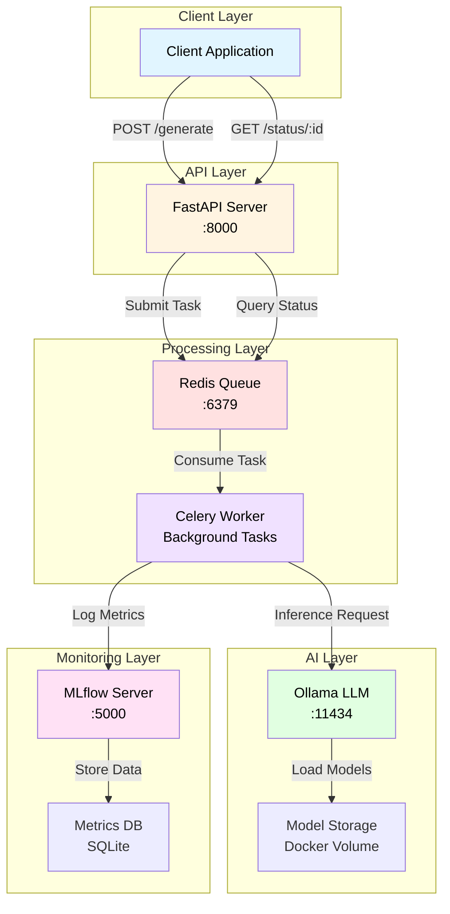
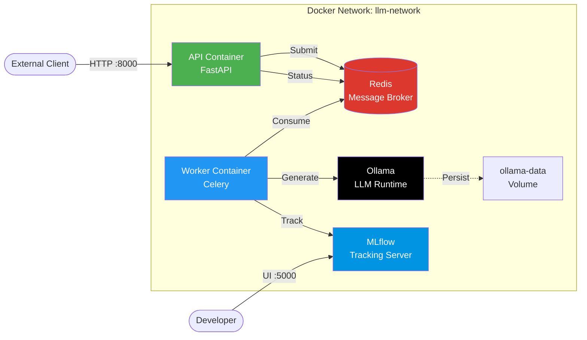
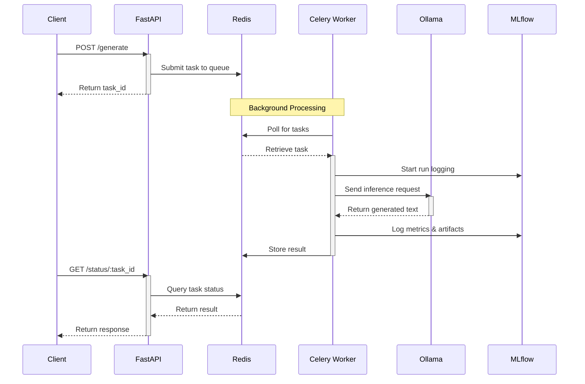
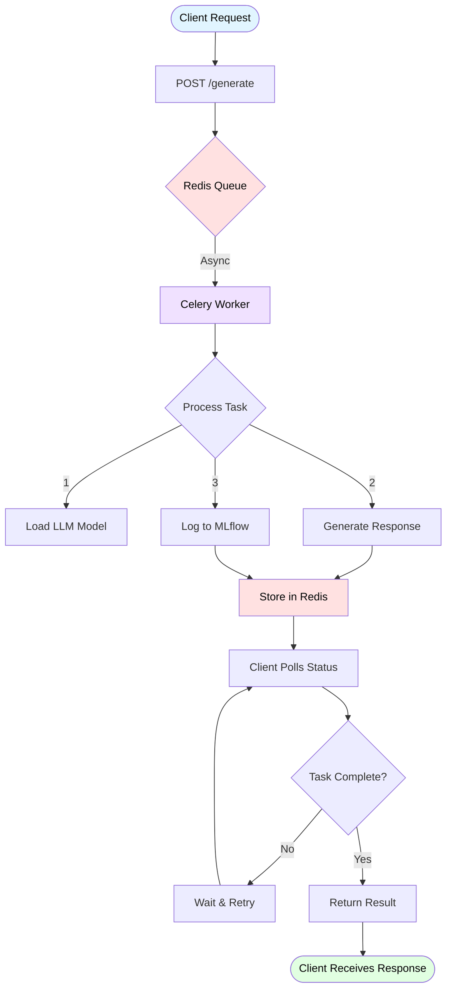

<div align="center">

# 🚀 LLM API Platform

### Production-Ready AI Inference Service with Async Processing & MLOps

[](https://fastapi.tiangolo.com/)
[](https://www.docker.com/)
[](https://docs.celeryproject.org/)
[](https://redis.io/)
[](https://mlflow.org/)

[Features](#-features) • [Quick Start](#-quick-start) • [Architecture](#-architecture) • [API Docs](#-api-reference) • [Contributing](#-contributing)

</div>

---

## 📋 Table of Contents

- [Overview](#-overview)
- [Features](#-features)
- [Architecture](#-architecture)
  - [System Overview](#system-overview)
  - [Container Architecture](#container-architecture)
  - [Request Flow Sequence](#request-flow-sequence)
  - [Data Flow](#data-flow)
- [Quick Start](#-quick-start)
  - [Prerequisites](#prerequisites)
  - [Installation](#installation)
  - [Access Points](#access-points)
- [API Reference](#-api-reference)
  - [Generate Text](#generate-text)
  - [Check Status](#check-status)
  - [Python Client Example](#python-client-example)
- [Configuration](#-configuration)
  - [Environment Variables](#environment-variables)
  - [Docker Compose Configuration](#docker-compose-configuration)
- [Monitoring & MLOps](#-monitoring--mlops)
  - [MLflow Dashboard](#mlflow-dashboard)
  - [Tracked Metrics](#tracked-metrics)
- [Development](#-development)
  - [Project Structure](#project-structure)
  - [Local Development](#local-development)
  - [Testing](#testing)
- [Troubleshooting](#-troubleshooting)
- [Roadmap](#-roadmap)
- [Contributing](#-contributing)
- [License](#-license)

---

## 🎯 Overview

A **production-grade Large Language Model API** built with modern best practices, featuring asynchronous processing, distributed task queues, and comprehensive MLOps integration. Perfect for building scalable AI applications with zero host dependencies.

### Why This Project?

- ✨ **Zero Configuration**: One command deployment with Docker Compose
- 🔄 **Async Architecture**: Non-blocking inference with Celery workers
- 📊 **Built-in MLOps**: Experiment tracking and metrics with MLflow
- 🐳 **Fully Containerized**: No manual installations required
- 🎯 **Production Ready**: Battle-tested patterns and error handling

---

## ✨ Features

<table>
<tr>
<td width="50%">

### Core Capabilities

- 🌐 **REST API** with FastAPI
- ⚡ **Async Endpoints** using httpx
- 🔄 **Background Processing** via Celery
- 📦 **Redis Queue** management
- 🎯 **Task Polling** system
- 🔧 **Environment Config** support

</td>
<td width="50%">

### MLOps & DevOps

- 📊 **MLflow Integration** for tracking
- 🐳 **Docker Compose** orchestration
- 💾 **Persistent Storage** for models
- 🔄 **Auto Model Pull** on startup
- 🪟 **Windows/WSL2** compatible
- 📈 **Metrics & Monitoring**

</td>
</tr>
</table>

---

## 🏗️ Architecture

### System Overview



### Container Architecture



### Request Flow Sequence



### Data Flow



---

## 🚀 Quick Start

### Prerequisites

```bash
# Only requirement
docker --version  # Docker 20.10+
docker compose version  # v2.0+
```

### Installation

```bash
# 1. Clone the repository
git clone https://github.com/Yahia995/llm-api.git
cd llm-api

# 2. Create environment configuration
cat > .env << EOF
OLLAMA_URL=http://ollama:11434/api/generate
REDIS_URL=redis://redis:6379/0
MLFLOW_TRACKING_URI=http://mlflow:5000
EOF

# 3. Start all services
docker compose up --build
```

**First Run:** On first startup, Ollama will automatically download the llama3 model (~4.7GB). This takes 3-5 minutes depending on your connection.

```bash
# Monitor the download progress
docker compose logs -f ollama
```

**Verification:**

```bash
# Check all services are running
docker compose ps

# Test the API
curl -X POST http://localhost:8000/generate \
  -H "Content-Type: application/json" \
  -d '{"prompt": "Hello, world!"}'
```

### Access Points

| Service | URL | Description |
|---------|-----|-------------|
| 🌐 API | http://localhost:8000 | REST API endpoint |
| 📚 Swagger | http://localhost:8000/docs | Interactive API docs |
| 📊 MLflow | http://localhost:5000 | Experiment tracking UI |
| 🤖 Ollama | http://localhost:11434 | Direct LLM access |

---

## 📡 API Reference

### Generate Text

Submit an LLM inference task for background processing.

**Endpoint:** `POST /generate`

**Request Body:**

```json
{
  "prompt": "Explain quantum computing in simple terms"
}
```

**Response:**

```json
{
  "task_id": "a72a58c5-96d4-4052-bdb8-80a923faca4f",
  "status": "Task submitted",
  "check_url": "/status/a72a58c5-96d4-4052-bdb8-80a923faca4f"
}
```

**cURL Example:**

```bash
curl -X POST http://localhost:8000/generate \
  -H "Content-Type: application/json" \
  -d '{"prompt": "What is FastAPI?"}'
```

---

### Check Status

Retrieve the status and result of a submitted task.

**Endpoint:** `GET /status/{task_id}`

**Response States:**

| Status | Description | Example Response |
|--------|-------------|------------------|
| `PENDING` | Task queued, not started | `{"task_id": "...", "status": "PENDING", "result": null}` |
| `PROGRESS` | Task in progress | `{"task_id": "...", "status": "PROGRESS", "result": {...}}` |
| `SUCCESS` | Task completed | `{"task_id": "...", "status": "SUCCESS", "result": {...}}` |
| `FAILURE` | Task failed | `{"task_id": "...", "status": "FAILURE", "error": "..."}` |

**Success Response Example:**

```json
{
  "task_id": "a72a58c5-96d4-4052-bdb8-80a923faca4f",
  "status": "SUCCESS",
  "result": {
    "model": "llama3",
    "response": "FastAPI is a modern, fast web framework for building APIs with Python...",
    "created_at": "2025-01-19T10:30:00.000000Z",
    "done": true,
    "total_duration": 1523456789,
    "load_duration": 12345678,
    "prompt_eval_count": 15,
    "eval_count": 42
  }
}
```

**cURL Example:**

```bash
curl http://localhost:8000/status/a72a58c5-96d4-4052-bdb8-80a923faca4f
```

---

### Python Client Example

```python
import requests
import time

class LLMClient:
    def __init__(self, base_url="http://localhost:8000"):
        self.base_url = base_url
    
    def generate(self, prompt: str, timeout: int = 60):
        """Submit task and wait for result"""
        # Submit task
        response = requests.post(
            f"{self.base_url}/generate",
            json={"prompt": prompt}
        )
        task_id = response.json()["task_id"]
        
        # Poll for result
        start_time = time.time()
        while time.time() - start_time < timeout:
            status = requests.get(
                f"{self.base_url}/status/{task_id}"
            ).json()
            
            if status["status"] == "SUCCESS":
                return status["result"]["response"]
            elif status["status"] == "FAILURE":
                raise Exception(status["error"])
            
            time.sleep(2)
        
        raise TimeoutError("Task did not complete in time")

# Usage
client = LLMClient()
result = client.generate("Explain Docker in one sentence")
print(result)
```

---

## ⚙️ Configuration

### Environment Variables

Create a `.env` file in the project root:

```env
# Ollama Configuration
OLLAMA_URL=http://ollama:11434/api/generate

# Redis Configuration
REDIS_URL=redis://redis:6379/0

# MLflow Configuration
MLFLOW_TRACKING_URI=http://mlflow:5000
```

**Note:** All services communicate via Docker network using service names (e.g., `ollama`, `redis`, `mlflow`).

### Docker Compose Configuration

Key configurations in `docker-compose.yml`:

```yaml
services:
  ollama:
    image: ollama/ollama:latest
    volumes:
      - ollama-data:/root/.ollama  # Persistent storage
    command:
      - |
        ollama serve & 
        sleep 5
        ollama pull llama3  # Auto-download on first run
        wait
  
  worker:
    command: celery -A app.celery_worker worker --pool=solo --loglevel=info
    # --pool=solo for Windows/WSL2 compatibility
```

---

## 📊 Monitoring & MLOps

### MLflow Dashboard

Access the MLflow UI at **http://localhost:5000**

**Features:**
- 📈 Track inference latency and token counts
- 🔍 Compare different prompts and responses
- 💾 Store generated outputs as artifacts
- 📊 Visualize performance metrics over time

### Tracked Metrics

| Metric | Description |
|--------|-------------|
| `latency_sec` | Total inference time |
| `prompt_eval_count` | Input token count |
| `eval_count` | Output token count |
| `total_duration` | Full processing time (ns) |

### Logged Artifacts

- Generated response text
- Full Ollama metadata
- Request parameters
- Timestamp information

### Viewing Experiments

1. Navigate to http://localhost:5000
2. Click on **Experiments** → **llm_inference**
3. View all runs with metrics and artifacts
4. Compare multiple runs side-by-side

---

## 🛠️ Development

### Project Structure

```
llm-api/
├── app/
│   ├── __init__.py
│   ├── main.py                 # FastAPI application
│   ├── celery_worker.py        # Celery task definitions
│   ├── core/
│   │   └── config.py           # Configuration management
│   ├── api/
│   │   └── generate.py         # API endpoints
│   ├── models/
│   │   └── schemas.py          # Pydantic models
│   └── services/
│       └── ollama_service.py   # Ollama client
├── mlflow/
│   ├── Dockerfile
│   └── mlruns/                 # Experiment data
├── docker-compose.yml
├── Dockerfile
├── requirements.txt
├── .env
├── .gitignore
└── README.md
```

### Local Development

```bash
# Install dependencies
pip install -r requirements.txt

# Run services individually
docker compose up redis ollama mlflow -d

# Run API locally (with hot reload)
uvicorn app.main:app --reload --host 0.0.0.0 --port 8000

# Run worker locally
celery -A app.celery_worker worker --loglevel=info
```

### Viewing Logs

```bash
# All services
docker compose logs -f

# Specific service
docker compose logs -f worker
docker compose logs -f api
docker compose logs -f ollama
docker compose logs -f mlflow
```

### Testing

```bash
# Quick API test
curl -X POST http://localhost:8000/generate \
  -H "Content-Type: application/json" \
  -d '{"prompt": "Test prompt"}'

# Check task status
curl http://localhost:8000/status/{task_id}
```

### Managing Services

```bash
# Restart specific service
docker compose restart worker

# Restart all services
docker compose restart

# Stop all services (preserves volumes)
docker compose down

# Stop and remove volumes (deletes models!)
docker compose down -v

# Rebuild after code changes
docker compose up --build
```

---

## 🔧 Troubleshooting

<details>
<summary><strong>🚨 Ollama model download fails</strong></summary>

**Symptoms:** First startup hangs or times out

**Solutions:**

```bash
# Check Ollama logs
docker compose logs ollama

# Manually pull model
docker compose exec ollama ollama pull llama3

# Restart Ollama service
docker compose restart ollama
```
</details>

<details>
<summary><strong>🚨 Worker cannot connect to Ollama</strong></summary>

**Symptoms:** Tasks fail with connection errors

**Solutions:**

```bash
# Verify network connectivity
docker compose exec worker ping -c 3 ollama

# Check Ollama is accessible
docker compose exec worker curl http://ollama:11434/api/tags

# Verify all services are on same network
docker network inspect llm-api_llm-network

# Restart all services
docker compose restart
```
</details>

<details>
<summary><strong>🚨 Tasks stuck in PENDING</strong></summary>

**Symptoms:** Tasks never complete

**Solutions:**

```bash
# Check worker is running
docker compose ps worker

# View worker logs for errors
docker compose logs -f worker

# Verify worker can reach Redis
docker compose exec worker ping -c 3 redis

# Restart worker
docker compose restart worker
```
</details>

<details>
<summary><strong>🚨 Redis connection refused</strong></summary>

**Symptoms:** Worker or API cannot connect to Redis

**Solutions:**

```bash
# Check Redis is running
docker compose ps redis

# View Redis logs
docker compose logs redis

# Verify Redis is accessible
docker compose exec api ping -c 3 redis

# Restart Redis
docker compose restart redis
```
</details>

<details>
<summary><strong>🚨 MLflow UI not loading</strong></summary>

**Symptoms:** Cannot access http://localhost:5000

**Solutions:**

```bash
# Check MLflow container status
docker compose ps mlflow

# View MLflow logs
docker compose logs mlflow

# Ensure port 5000 is not in use
# Linux/Mac
lsof -i :5000

# Windows
netstat -ano | findstr :5000

# Restart MLflow
docker compose restart mlflow
```
</details>

<details>
<summary><strong>🚨 Port already in use</strong></summary>

**Symptoms:** `Error: bind: address already in use`

**Solutions:**

```bash
# Find process using port (Linux/Mac)
lsof -i :8000

# Find process using port (Windows)
netstat -ano | findstr :8000

# Kill the process
kill -9 <PID>

# Or change ports in docker-compose.yml
```
</details>

<details>
<summary><strong>🚨 Out of disk space</strong></summary>

**Symptoms:** Docker runs out of space

**Solutions:**

Models are ~4-5GB. Clean up unused Docker resources:

```bash
# Remove unused containers, networks, images
docker system prune -a

# Remove unused volumes (WARNING: deletes model data!)
docker volume prune

# Check Docker disk usage
docker system df
```
</details>

### Common Commands

```bash
# View resource usage
docker stats

# Inspect specific container
docker inspect llm_worker

# Execute command in container
docker compose exec worker bash

# View all networks
docker network ls

# View all volumes
docker volume ls
```

---

## 🗺️ Roadmap

### Phase 1: Core Infrastructure ✅

- [x] FastAPI REST API
- [x] Celery background processing
- [x] Redis message queue
- [x] Docker Compose orchestration
- [x] MLflow integration
- [x] Containerized Ollama

### Phase 2: Enhanced Features 🚧

- [ ] GPU support for Ollama
- [ ] Multiple model support (model selection per request)
- [ ] Streaming responses via WebSocket
- [ ] Request caching layer
- [ ] Rate limiting and authentication
- [ ] Health check endpoints

### Phase 3: Production Hardening 📋

- [ ] Prometheus metrics export
- [ ] Grafana dashboards
- [ ] Auto-scaling workers
- [ ] Load balancing
- [ ] Circuit breakers
- [ ] Request retry logic
- [ ] Dead letter queue

### Phase 4: Advanced ML 🔮

- [ ] Fine-tuning pipeline
- [ ] Model versioning
- [ ] A/B testing framework
- [ ] Batch inference
- [ ] Custom model registry
- [ ] Hugging Face integration

---

## 🤝 Contributing

We welcome contributions! Here's how you can help:

### Development Workflow

1. **Fork** the repository
2. **Create** a feature branch (`git checkout -b feature/amazing-feature`)
3. **Commit** your changes (`git commit -m 'Add amazing feature'`)
4. **Push** to the branch (`git push origin feature/amazing-feature`)
5. **Open** a Pull Request

### Code Standards

- Follow **PEP 8** for Python code
- Add **tests** for new features
- Update **documentation**
- Run linters before committing:
  ```bash
  black app/
  flake8 app/
  ```

### Reporting Issues

- Use the issue tracker
- Include reproduction steps
- Provide error messages and logs
- Specify your environment (OS, Docker version)

---

## 📚 Resources

### Documentation

- 📖 [FastAPI Documentation](https://fastapi.tiangolo.com/)
- 🔄 [Celery Documentation](https://docs.celeryproject.org/)
- 🤖 [Ollama Documentation](https://github.com/ollama/ollama)
- 🐳 [Ollama Docker Hub](https://hub.docker.com/r/ollama/ollama)
- 📊 [MLflow Documentation](https://mlflow.org/docs/latest/)
- 🐳 [Docker Compose Documentation](https://docs.docker.com/compose/)

### Tutorials

- [Building Production APIs with FastAPI](https://fastapi.tiangolo.com/tutorial/)
- [Celery Best Practices](https://docs.celeryproject.org/en/stable/userguide/tasks.html)
- [MLflow Tracking Guide](https://mlflow.org/docs/latest/tracking.html)

---

## 📄 License

This project is licensed under the MIT License - see the [LICENSE](LICENSE) file for details.

```
MIT License

Copyright (c) 2025 Yahia Achouri

Permission is hereby granted, free of charge, to any person obtaining a copy
of this software and associated documentation files (the "Software"), to deal
in the Software without restriction...
```

---

## 🌟 Acknowledgments

Built with ❤️ using these amazing technologies:

- **[FastAPI](https://fastapi.tiangolo.com/)** - Modern Python web framework
- **[Ollama](https://ollama.ai/)** - Run LLMs locally
- **[Celery](https://docs.celeryproject.org/)** - Distributed task queue
- **[Redis](https://redis.io/)** - In-memory data structure store
- **[MLflow](https://mlflow.org/)** - ML lifecycle platform
- **[Docker](https://www.docker.com/)** - Container platform

---

<div align="center">

**⭐ Star this repo if you find it helpful! ⭐**

Made with ❤️ by [Yahia Achouri](https://github.com/Yahia995)

[Report Bug](https://github.com/Yahia995/llm-api/issues) · [Request Feature](https://github.com/Yahia995/llm-api/issues) · [Documentation](https://github.com/Yahia995/llm-api/wiki)

</div>
